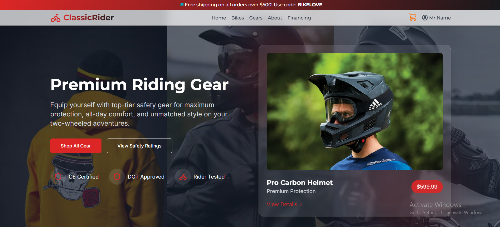
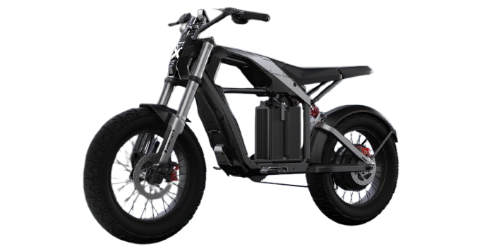

# 🚴‍♂️ Bike Shop Admin Dashboard



A modern, responsive, and feature-rich **Bike Shop Admin Dashboard** built with **React**, **Redux Toolkit**, **Tailwind CSS**, and **TypeScript**. This dashboard empowers admins to manage products, orders, and customers with ease and style.

---

## 🚀 Live Demo

👉 [Live Demo](https://classic-rider.netlify.app)

---

## ✨ Features

### 🛠️ Admin Features
- **Customer Management**: View, activate, deactivate, and delete customers. Search and filter with ease.
- **Order Management**: Track, update, and manage order statuses (Pending, Processing, Shipped, Delivered, Cancelled).
- **Product Management**: Add, edit, and delete products. Manage inventory and categories.
- **Dashboard Overview**: Visualize key metrics (sales, orders, customers) with beautiful charts and quick actions.

### 🛒 Customer Features
- **Order History**: View past orders and their statuses.
- **Profile Management**: Update personal info and change password.

---

## 🖥️ Screenshots

| Dashboard Overview | Product Management | Order Management |
|-------------------|-------------------|-----------------|
|  |  |  |

---

## 🧑‍💻 Technology Stack

- **Frontend**: React, Redux Toolkit (RTK Query), Tailwind CSS, TypeScript
- **Backend**: Node.js, Express.js, MongoDB, Mongoose
- **Other Tools**: React Router, Vite, Sonner (toast notifications)

---

## ⚡ Quick Start

### Prerequisites
- Node.js (v16+)
- MongoDB (for backend)

### 1. Clone the Repository
```bash
git clone https://github.com/your-username/bike-shop-admin-dashboard.git
cd bike-shop-admin-dashboard
```

### 2. Install Dependencies
```bash
npm install
```

### 3. Start the Development Server
```bash
npm run dev
```

The app will be running at [http://localhost:5173](http://localhost:5173)

---

## 📁 Project Structure

```
bnikeshop-frontend/
├── public/
├── src/
│   ├── assets/
│   ├── components/
│   ├── context/
│   ├── data/
│   ├── hooks/
│   ├── images/
│   ├── redux/
│   ├── types/
│   └── utils/
├── package.json
└── ...
```

---

## 🤝 Contributing

Contributions, issues, and feature requests are welcome! Feel free to check the [issues page](https://github.com/your-username/bike-shop-admin-dashboard/issues).

---


---

## 🙏 Acknowledgements

- [React](https://react.dev/)
- [Redux Toolkit](https://redux-toolkit.js.org/)
- [Tailwind CSS](https://tailwindcss.com/)
- [Vite](https://vitejs.dev/)
- [Sonner](https://sonner.emilkowal.ski/)

---

> _Built with ❤️ by the Bike Shop Team_